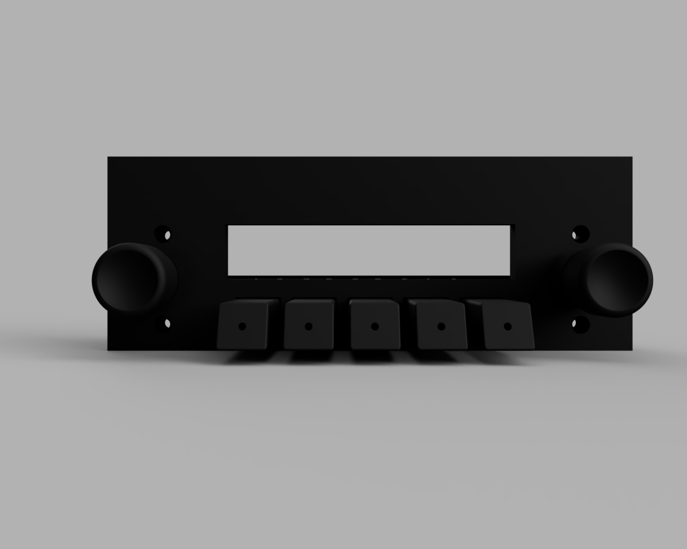
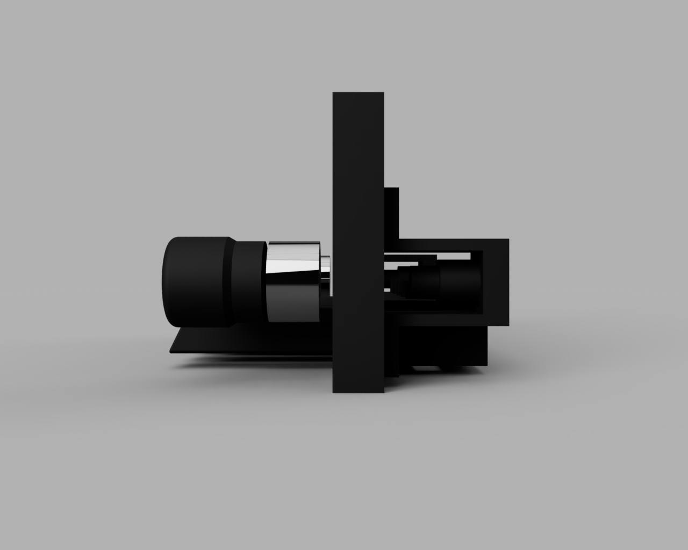
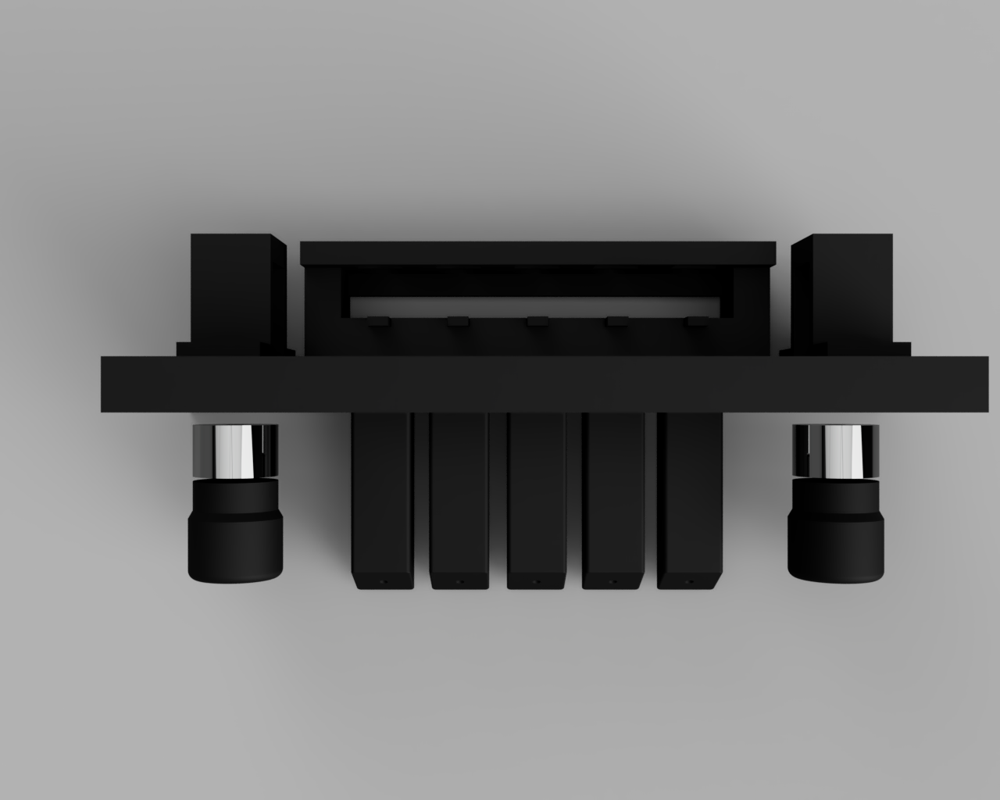
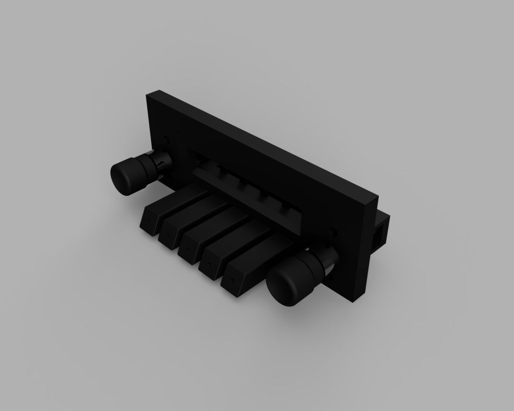

# esp32-headunit
ESP32 Powered Headunit for a Datsun (WIP)

.gif)

<!-- Havent made this work yet :'(
<video controls>
  <source src="https://github.com/MattMcGregor99/esp32-headunit/blob/main/gallery/renders/360.mp4" type="video/mp4">
  Your browser does not support the video tag.
</video>
-->
